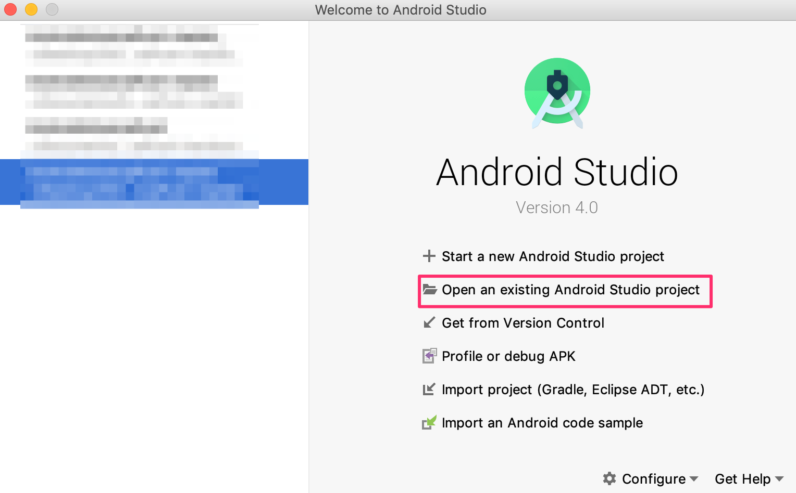
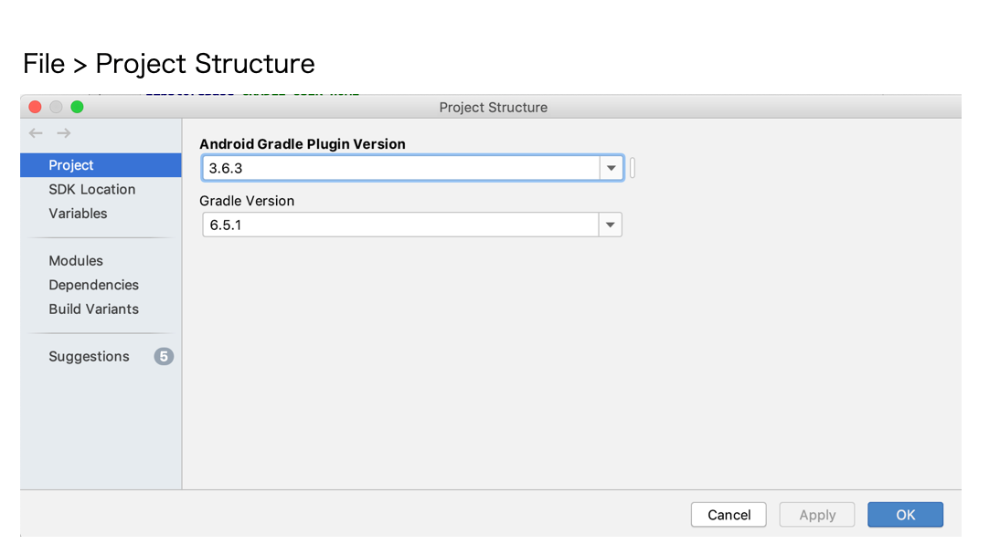
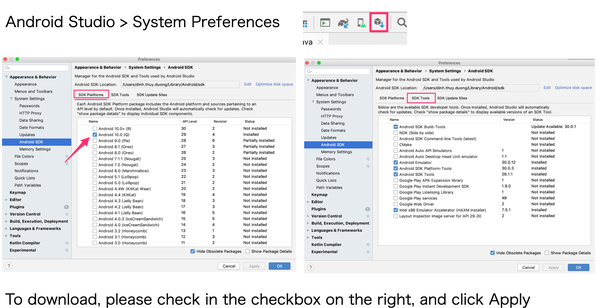
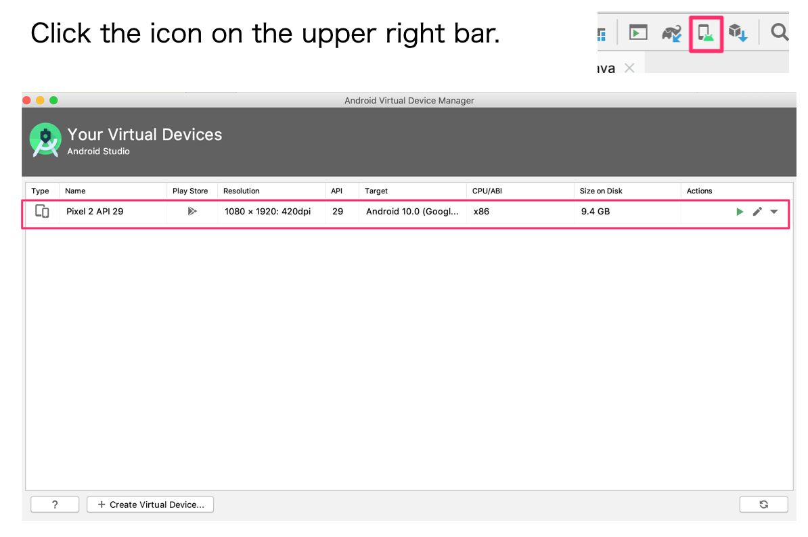

# Notice before about project

## Project download link

Click the link below to download a ZIP file of Handson project▼

[https://github.com/NIFCLOUD-mbaas/AndroidAdvancePush/archive/handson.zip](https://github.com/NIFCLOUD-mbaas/AndroidAdvancePush/archive/handson.zip)

After download, you need to unzip, and use Android Studio to open by select "Open an existing Android Studio project"
and select the folder you unzipped the project.

## Operating Environment(2020/7 Updated)

This Seminar project is prepared for the following environment
* Android Studio ver3.6.1/ver4.0.0
* Android OS ver.9/ver.10 (Real machine)
* NIFCLOUD mobile backend Android SDK ver.3.0.4

## Recommended Environment(2020/7 Updated)

### 1. Check the Gradle version of the project

After you opened the project by AndroidStudio, open File menu > Project Structur to check if the Gradle version is correct or not. If not, please update as follows.

### 2. Check the Android SDK tool of the project

Check if your PC and AndroidStudio have all necessary SDK tool by, in AndroidStudio menu, open System Preferences.
Open Appearance & Behavior > System Settings > Android SDK.
There are 2 tabs you need to check, SDK Platform and SDK Tool.
If there is anything has not been installed, please check in the checkbox and click Apply to download. You can reference the tested environment as pictures below.

### 3. Install recommended emulator

You can use real devices to test, but if it is not possible, emulators can be used too. You can download emulator beforehand to test, and the recommended tested emulator is Pixel 2 API 29.

