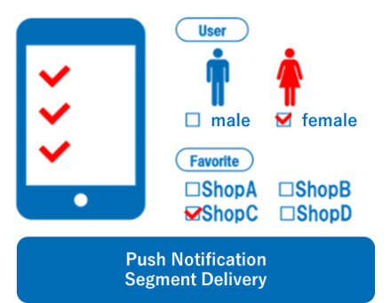
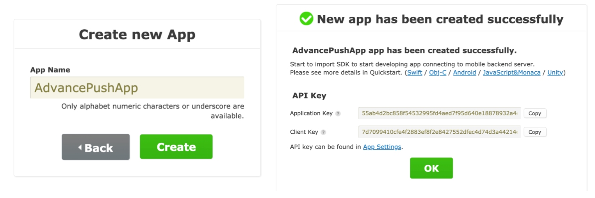
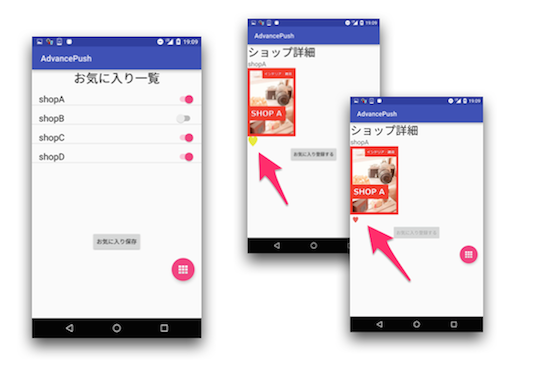
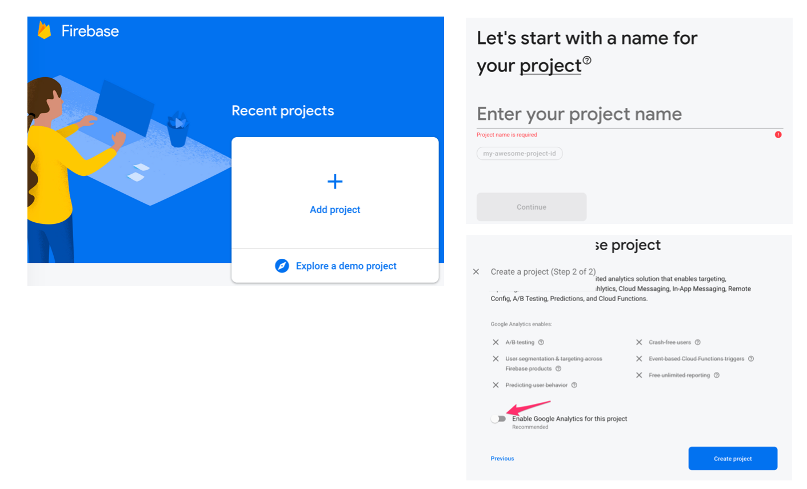
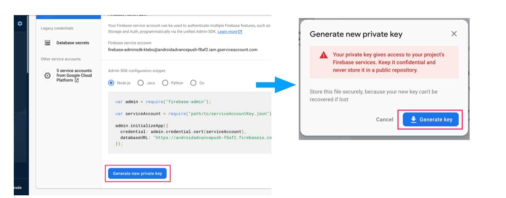
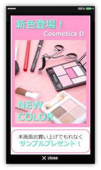

name: inverse
layout: true
class: center, middle, inverse
---
# <span style="font-size: 30%">【Android version】NIFCLOUD Mobile Backend Level-up Seminar</span><br>__Let's Create<br>a Coupon Delivery App!__</span>

@ncmbadmin

.footnote[
20160817 Created (202006 Updated)
]
---
layout: false
## Preparation
If you have not registered an account with NIFCLOUD mobile backend yet<br>
[Service Site](https://mbaas.nifcloud.com/en/) Click the "Free Registration" button in the upper right corner<br>
to register your account.


---
## Preparation
Register with one of the following accounts
- Registration with SNS ID（credit card payment）* Available for free
  - You can register with your SNS account login. Facebook, Twitter and Google are available.
  - Register from [Here](https://console.mbaas.nifcloud.com/signup)
  - * It is recommended for the access from outside of Japan (Described on the next page)
- Registration with NIFCLOUD ID（Invoice payment) * For Expert plan or higher plan
  - You need to register NIFCLOUD ID first.
  - Register from [Here](https://sso.nifcloud.com/auth/realms/nifcloud/protocol/openid-connect/registrations?client_id=user-registration&response_type=code&redirect_uri=%2Fcomp-registration.html&entry_code=N00000470100)

---
## Preparation(Access from outside of Japan)

- English service site is here
https://mbaas.nifcloud.com/en/
- Control panel supports "Japanese, English, Chinese (Traditional)"
- To change the language, please see below:


---
## Operating Environment

This Seminar project is prepared for the following environment
* Android Studio ver3.6.1
* Android OS ver.9 (Real machine)
* NIFCLOUD mobile backend Android SDK ver.3.0.4

---
## About this Hands-on Seminar
### Format of the Seminar

- We will implement functions in 3 steps.
- Create an App in lecture style by repeating instructions and exercises.
- Whole progress will be chekced by taking the operation check time and break time.
- Q&A time will be held at any time.
- We have translated the materials as much as possible.
However, some App screen, control panel and function name are still in Japanese.
We will supplementary explain for those, but we appreciated your understanding in advance.

---
## Hands-on Overview
### About the App to create

* Understand the function of mBaaS by creating a App "mBaaS Shop List" a kind of coupon delivery App.
* Code the mBaaS integration to complete the App, and realize:
 * After registration to become member, App users can see shop information.
 * App users can register favorite stores and receive push notifications from those stores.
 * Push notifications can be sent selectively by gender or Region.
 * Coupon can be directly delivered through push notification from the store.
 * Push notifications can be automatically sent at a fixed time.

---
## Hands-on Overview
### About App to create

.center[

]

---
## What is NIFCLOUD mobile backend?
### Service Introduction

* This service is a Cloud service that provides functions that are commonly implemented in smartphone App.
 * Commonly called "mBaaS"
* Here are the list of functions.

.center[

]

---
## About this Hands-on Seminar
### Contents：How to Use Datastore Function

Through the creation of "mBaaS Shop List" App, we will register, display and manage
the data of shop information and user's favorites information using the Datastore Management function.

---
## About this Hands-on Seminar
### Contents：How to Use User Management Function

Through the creation of "mBaaS Shop List" App, user login and logout to be implemented,
and users linked favorites information to be registered, displayed and managed.
These functions to be implemented using the User Management function
---
## About this Hands-on Seminar
### Contents：How to Use Filestore Function

Through the creation of "mBaaS Shop List" App, the image displayed by the shop and PR image of the sale information
to be managed using Filestore.

---
## About this Hands-on Seminar
### Contents: Practice Push Notification①

Through the creation of "mBaaS Shop List" App, we understand how to build<br>
effective push notifications that increase active user rate.

.center[

]

---
## About this Hands-on Seminar
### Contents：Practice Push Notification②

Through the creation of "mBaaS Shop List" App, we understand how to build<br>
effective push notifications that increases active user rate.<br>

.center[

]

---
## About this Hands-on Seminar
### Contents：Practice Push notification③

Through the creation of "mBaaS Shop List" App, we understand how to build<br>
effective push notifications that increases active user rate.<br><br>

.center[

]

---
## What is NIFCLOUD mobile backend?
### Android SDK Features

* You need to install SDK
 * Already implemented this time
 * Reference：[Quick Start](https://mbaas.nifcloud.com/doc/current/introduction/quickstart_android.html)
* SDK initialization process is required
 * Please add the following code at the beginning of MainActivity.java to load installed SDK.

```java
import com.nifcloud.mbaas.core.NCMB;
```

 * Initialize the App

```java
NCMB.initialize(this.getApplicationContext(),"YOUR_APPLICATION_KEY","YOUR_YOUR_CLIENT_KEY");
```

---
## What is NIFCLOUD mobile backend?
### Android SDK Features

* Processing methods when making requests to the server include __synchronous processing__ and __asynchronous processing__

```java

// i.e.）To Save
/* synchronous processing */

NCMBObject obj = new NCMBObject("SaveObjectTest");
obj.put("key", "value");
obj.save();

```

---
## What is NIFCLOUD mobile backend?
### Android SDK Features

* Processing methods when making requests to the server include　__synchronous processing__ and __asynchronous processing__

```java
/* asynchronous processing */

NCMBObject obj = new NCMBObject("SaveObjectTest");
obj.put("key", "value");
obj.saveInBackground(new DoneCallback() {
    @Override
    public void done(NCMBException e) {
        if (e != null) {
            //Processing when an error occurs
        } else {
            //Processing on success
        }
    }
});

```

---
## What is NIFCLOUD mobile backend?
### Android SDK Features

* synchronous processing and asynchronous processing
 * The synchronous processing does not perform next process until its synchronous processing completion:
 * Asynchronous process executes the process in the background and executes the next process. You can specify in advance with DoneCallback() the implementation after processing:


---
## Agenda for Hands-on

__<font color="#49a7e5" size="5">Day 1&nbsp;</font><font size="6">Let's create"mBaaS Shop List" App!</font>__

.size_large[
1. Preparation for Hands-on
1. Create User Management function
1. Setting Shop Information
]

__<font color="#49a7e5" size="5">Day 2&nbsp;</font><font size="6">Let's prepare for Favorite features and push notifications!</font>__

.size_large[
1. Create a Favorites Feature
1. Prepare Push Notifications
]

---
## Agenda for Hands-on (continued)

__<font color="#49a7e5" size="5">Day 3&nbsp;</font><font size="6">Let's deliver push notifications!</font>__
.size_large[
1. Deliver push notifications: Segment delivery
1. Deliver push notification: Rich push
1. Deliver push notification: Payload
]

---
layout: true
class: center, middle, inverse_sub
---
#Let's create <br>"mBaaS Shop List" App!

.size_large[
＜Day 1＞
]

---
layout: true
class: center, middle, inverse
---
# 1.Preparation for Hands-on

---
layout: false
## Preparation for Hands-on
### Download project

Click the link below to download a ZIP file▼<br>
.size_medium[
　　　 __[AndroidAdvancePush](https://github.com/NIFCLOUD-mbaas/AndroidAdvancePush/archive/handson.zip)__
]

* Unzip the file.
* Open the project you just downloaded in Android Studio.

.center[

]

---
layout: false
## Preparation for Hands-on
### Preparation for project

* Adjust the view of your project in Android Studio.
  - Select [Android] in the view options item on the upper left.

.center[

]

---
layout: false
## Preparation for Hands-on
### Preparation of project

* Check the file structure of the project in Android Studio.
  - Please confirm that the processing files are included as shown below.

.center[

]

---
## Preparation for Hands-on
### What is already done for the project

* mBaaS Android SDK v.3.0.4 installation, build.graddle setting, AndroidManifest setting already implemented
* build.gradle

```text
buildscript {
    dependencies {
        classpath 'com.android.tools.build:gradle:3.2.0'
    }
}

allprojects {
    repositories {
        jcenter()
        google()
    }
}
```

---
## Preparation for Hands-on
### What is already done for the project


* app/build.gradle

```
repositories {
    maven {
        url 'https://maven.google.com'
    }
}
```

```
dependencies {
    implementation 'com.google.code.gson:gson:2.3.1'
    <<Abbreviation>>
    api files('libs/NCMB.jar')
}
```

---
## Preparation for Hands-on
### What is already done for the project

* AndroidManifest.xml

```
<uses-permission android:name="android.permission.INTERNET" />
<uses-permission android:name="android.permission.ACCESS_NETWORK_STATE" />

<<Abbreviation>>

<activity
    android:name=".MainActivity"
    android:label="@string/app_name"
    android:theme="@style/AppTheme.NoActionBar" >
    <intent-filter>
        <action android:name="android.intent.action.MAIN" />
        <category android:name="android.intent.category.LAUNCHER" />
    </intent-filter>
</activity>
<activity android:name=".LoginActivity" />
<activity android:name=".SignupActivity" />
<activity android:name=".RegisterActivity" />
<activity android:name=".ShopActivity" />
<activity android:name=".FavoriteActivity" />
<activity android:name=".InfoActivity" />

```

---
## Preparation for Hands-on
### What is already done for the project

* Pre-coding files is mainly as below
 * Create the design of App in the `files in the layout folder`, and to code the Action processing for each screen in an `Activity files`

.center[

]

---
## Preparation for Hands-on
### Preparation of mBaaS

* Login to [mBaaS](https://console.mbaas.nifcloud.com/) to create the App
* On the App creation screen, enter the App name and click "+ New App"
* If the App is created successfully, the "application key" and "client key" (API key) of the new App will be displayed.
Make a note of them by copy and paste as we will use them later.



---
## Preparation for Hands-on
### API key setting and SDK initialization

* Open the `MainActivity.java`
* Add in the `onCreate()` method following process below the comment[Library import processing is already implemented]

```java
//**************** 【mBaaS/Initialization: Specify API key】***************
NCMB.initialize(this.getApplicationContext(),"YOUR_APPLICATION_KEY","YOUR_CLIENT_KEY");
```

---
## Preparation for Hands-on
### API key setting and SDK initialization

* Please replace the "`YOUR_APPLICATION_KEY`" and "`YOUR_CLIENT_KEY`" parts of the initialization process to the API key issued when the App was created.
 * If you haven't made a note before, you can find API keys again from the mBaaS management screen in "App Settings" → "Basic"

.center[

]

---
layout: true
class: center, middle, inverse
---
# 2.Create User Management function

---
layout: false
## Create User Management function
### mBaaS settings

* mBaaS has "ID/Password Authentication" and "Email Address/Password Authentication" as User Management function.
In this hands-on, we will use "Email Address/Password Authentication" function.
* Allow "Email Address/Password Authentication" in User Authentication Settings.

.center[

]


---
## Create User Management Function

### User Management①：Request a Membership Registration email

.center[

]

---
## Create User Management function
### User Management①：Request a membership registration email

* Open `SignupActivity.java`.
* Open `doSignupByEmail()`method. Open the place where the following comment is written.
```java
//**************** 【mBaaS/User①】: Request a Membership Registration email】***************
```
* For member registration process, please add the implementation code as follows
```java
//**************** 【mBaaS/User①】: Request a Membership Registration email】***************
String email = _signupEmail.getText().toString();
NCMBUser.requestAuthenticationMailInBackground(email, new DoneCallback() {
     @Override
     public void done(NCMBException e) {
         if (e != null) {
             // process for failed requests for membership registration mail
         } else {
             // process for successful request of member registration mail
         }
     }
 });
```

---
## Create User Management function
### User Management①：Request a membership registration email[Already implemented]

* Please add each processing

```java
// process for failed requests for membership registration mail
new AlertDialog.Builder(SignupActivity.this)
        .setTitle("Notification from NIFCLOUD")
        .setMessage("Send failed! Error:" + e.getMessage())
        .setPositiveButton("OK", null)
        .show();
```

```java
// process for successful request of member registration mail
new AlertDialog.Builder(SignupActivity.this)
        .setTitle("Notification from NIFCLOUD")
        .setMessage("Mail delivery completed! Please check email.")
        .setPositiveButton("OK", new DialogInterface.OnClickListener() {
            public void onClick(DialogInterface dialog, int which) {
                //Login screen transition
                Intent intent = new Intent(getApplicationContext(), LoginActivity.class);
                startActivityForResult(intent, REQUEST_RESULT);
            }
        })
        .show();
```
---
## Create User Management Function
### User Management②：Login with email address and password

.center[

]

---
## Create User Management Function
### User Management②：Login with email address and password
* Open `LoginActivity.java`.
* Open `doLogin()` method. Open the following comment.

```java
//**************** 【mBaaS/User②】: Login with email address and password】***************
```

---
## Create User Management Function
### User Management②：Login with email address and password

* Please add the login process as follows.

```java
//**************** 【mBaaS/User②】: Login with email address and password】***************
String email = _loginEmail.getText().toString();
String password = _loginPassword.getText().toString();

NCMBUser.loginWithMailAddressInBackground(email, password, new LoginCallback() {
    @Override
    public void done(NCMBUser user, NCMBException e) {
        if (e != null) {
            //process for log in failures
        } else {
            //process for successful login
        }
    }
});
```

---
## Create User Management Function
### User Management②：Login with email address and password

* Please add each processing

```java
//process for log in failures
new AlertDialog.Builder(LoginActivity.this)
        .setTitle("Notification from NIFCLOUD")
        .setMessage("Login failed! Error:" + e.getMessage())
        .setPositiveButton("OK", null)
        .show();
```

---
### User Management②：Login with email address and password

* Please add each processing (continued)

```java
//process for successful login
common.currentUser = NCMBUser.getCurrentUser();
AlertDialog show = new AlertDialog.Builder(LoginActivity.this)
        .setTitle("Notification from NIFCLOUD")
        .setMessage("Login Succeeded")
        .setPositiveButton("OK", new DialogInterface.OnClickListener() {
            public void onClick(DialogInterface dialog, int which) {
                String nickname = common.currentUser.getString("nickname");
                if (nickname != null && !nickname.isEmpty() && !nickname.equals("null")) {
                    //main screen transition
                    Intent intent = new Intent(getApplicationContext(), MainActivity.class);
                    startActivityForResult(intent, REQUEST_RESULT);
                } else {
                    // transition to member registration screen for initial login.
                    Toast.makeText(LoginActivity.this, "Register user information
                    for the first time!", Toast.LENGTH_LONG).show();
                    Intent intent = new Intent(getApplicationContext(),
                    RegisterActivity.class);
                    startActivityForResult(intent, REQUEST_RESULT);
                }
            }
        })
        .show();
```

---
## Create User Management Function
### Operation check(1)Let's log in

* Build on the simulator/actual device and check the operation.
* Tap "Member registration on the login screen
* Enter email address on the member registration screen, and tap "Send registration email"
 * Check the message
 * Check here if you get an error.
 [Error code list](https://mbaas.nifcloud.com/doc/current/rest/common/error.html#REST%20APIのエラーコードについて)

---
## Create User Management Function
### Operation check(1)Let's log in

.center[

]

---
## Create User Management Function
### Operation check(1)Let's log in

* You will receive a member registration email, then set a password for new user, repeat the password once more for confirmation of password
*  (Form is shown in Japanese, but it can customized, we skipped this time)

.center[

]

---
## Create User Management Function
### Operation check(1)Let's log in

* Return to the login screen again, and log in with your "email address" and "password". Make sure that you can log in successfully.
 * Please check the log.
* In addition, check the registered user information on the mBaaS management screen.
 * Select "User Management" at the the administration screen, and then select "All Users".
 * Users are registered in user list

.center[

]
.footnote[
[Error code list](https://mbaas.nifcloud.com/doc/current/rest/common/error.html#REST%20APIのエラーコードについて)
]

---
## Create User Management Function
### About Code(1)Let's Log in!

* In order to request an email for membership registration, we make an API request using the following method provided by the Android SDK.
```java
NCMBUser.requestAuthenticationMailInBackground(email, DoneCallback());
```
* A default membership registration email format will be sent. (This time email is in Japanese, but the mail format and domain can be customized.)

---
## Create User Management Function
### About Code(1)Let's Log in!

* Once the membership registration is completed, we do log in it. To perform the login, Android SDK requests API to log in
using the following method.
```java
NCMBUser.loginWithMailAddressInBackground(email, password, new LoginCallback());
```
* As parameters, we receive email and password from the input form, and generate a request in the method to communicate to the server.
When the result is returned from the server side, the pattern processing which is a normal/error judgment of NCMBException is performed in LoginCallback ().

---
## Create User Management Function
### User Management③：Update User Information

* When you log in for the first time, a screen for registering user attributes will appear. we are now going to proceed the user information registration process.
.center[

]

---
## Create User Management Function
### User Management③：Update User Information


* Open `RegisterActivity.java`
* Open `doRegister()`
* Implement the process of adding the information entered on the first-time user information registration screen to the mBaaS user information.
* We are now going to add code below the comment.

```java
//**************** 【mBaaS/User③: Update User Information】***************


```

* Please be careful as it is very far down.

---
## Create User Management Function
### User Management③：Update User Information

* Here is the code we are going to add

```java
//**************** 【mBaaS/User③: Update User Information】***************
common.currentUser.put("nickname", nickname);
common.currentUser.put("prefecture", prefecture);
common.currentUser.put("gender", selectedGender);
common.currentUser.put("favorite",list);

common.currentUser.saveInBackground(new DoneCallback() {
    @Override
    public void done(NCMBException e) {
        if (e != null) {
            // Process at Update Failures

        } else {
            // Process on successful update

        }
    }
});

```

---
## Create User Management Function
### User Management③：Update User Information

* Add processing for each.

```java
// Process at Update Failures
new AlertDialog.Builder(RegisterActivity.this)
        .setTitle("Notification from NIFCLOUD")
        .setMessage("Save failed! Error:" + e.getMessage())
        .setPositiveButton("OK", null)
        .show();
```

```java
// Process on successful update
new AlertDialog.Builder(RegisterActivity.this)
       .setTitle("Notification from NIFCLOUD")
       .setMessage("Save succeeded! Thank you for entering.")
       .setPositiveButton("OK", new DialogInterface.OnClickListener() {
           public void onClick(DialogInterface dialog, int which) {
               Intent intent = new Intent(getApplicationContext(), MainActivity.class);
               startActivityForResult(intent, REQUEST_RESULT );
           }
       })
       .show();
```

---
## Create User Management Function
### User Management③：Update User Information

* Implementation of the Update User Information is now done.
* Once we implemente the next step "Setting Shop Information", let's do operation check together.
* Let's go on to the next step.

---
layout: true
class: center, middle, inverse
---
# 3.Setting Shop Information

---
layout: false
## Setting Shop Information
### Prepare Shop information in mBaaS (Datastore)

* Open "Datastore" from management screen of NIFCLOUD mobile backend, then click "+Create▼" button, then click "Import".
* Type "__Shop__" at the class name (Please note that S should be capitalized!)
* Select "__Shop.json__" located in the setting folder of the downloaded sample project, and upload it.

.center[

]

---
## Setting Shop Information
### Prepare Shop information in mBaaS (Datastore)

Here you can see how it is imported.

.center[

]

---
## Setting Shop Information
### Prepare Shop information in mBaaS (Filestore)

* Open "Filestore" from the NIFCLOUD mobile backend administration screen, and click the "↑ Upload" button.
* Upload all files located in "icon" "Shop" "Sale" which are in the Setting folder in the sample project that you downloaded.

---
## Setting Shop Information
### Prepare Shop information in mBaaS (Filestore)

.center[

]

---
## Setting Shop Information
### Prepare Shop information in mBaaS (Filestore)

* Here you can see how it is uploaded.

.center[

]

---
## Setting Shop Information
### Datastore: Obtain data of "Shop" class

* First, we are going to implement datastore processing.
* Open `MainActivity.java`
* Open `doLoadShop()`
* Implement the processing to obtain data of imported Shop class
  - We are now going to add code below the comment.

```java
//**************** 【mBaaS/Shop①: Obtain data of "Shop" class】***************


```

---
## Setting Shop Information
### Datastore: Obtain data of "Shop" class

* Here is the code we are going to add

```java
//**************** 【mBaaS/Shop①: Obtain data of "Shop" class】***************
// Create query for "Shop" class
NCMBQuery<NCMBObject> query = new NCMBQuery<>("Shop");
//Search data from datastore
List<NCMBObject> results = query.find();
//Update Global Variables
common.shops = results;
ListView lv = (ListView) findViewById(R.id.lstShop);
lv.setAdapter(new ShopListAdapter(this, results));
```


---
## Setting Shop Information
### Filestore①：icon image acquisition

* We are now going to implement image processing of icons displayed in the store list.
.center[

]

---
## Setting Shop Information
### Filestore①：icon image acquisition

* We are going to do the image acquisition processing registered in the filestore.
* Open `ShopListAdapter.java`
 * `ShopListAdapter.java` is a file to create list items
* Implement the process to acquire each shop's icon from mBaaS, and to display them on the top screen.
- We are now going to add code below the comment.

```java
//**************** 【mBaaS/File①: shop image acquisition】***************


```

---
## Setting Shop Information
### Filestore①：icon image acquisition

* Here is the code we are going to add

```java
//**************** 【mBaaS/File①: shop image acquisition】***************
        try {
            NCMBFile file = new NCMBFile(filename);
            file.fetchInBackground(new FetchFileCallback() {
                @Override
                public void done(byte[] data, NCMBException e) {
                    if (e != null) {
                        // Process at acquiition failures
                        Log.d(TAG, e.getMessage());
                    } else {
                        // Process on successful acquisition
                        Bitmap bmp = null;
                        if (data != null) {
                            bmp = BitmapFactory.decodeByteArray(data, 0, data.length);
                        }
                        holder.img.setImageBitmap(bmp);
                    }
                }
            });
        } catch (NCMBException e) {
            e.printStackTrace();
        }
```

---
## Setting Shop Information
### Filestore①：icon image acquisition

* Add processing for each.

```java
// Process at acquiition failures
Log.d(TAG, e.getMessage());
```

```java
// Process on successful acquisition
Bitmap bmp = null;
if (data != null) {
    bmp = BitmapFactory.decodeByteArray(data, 0, data.length);
}
holder.img.setImageBitmap(bmp);
```

---
## Setting Shop Information
### Filestore②：Shop image acquiition

* We are now going to display the detail of the shop.
.center[

]

---
## Setting Shop Information
### Filestore②：Shop image acquisition

* We are going to do image acquisition processing registered in the filestore
* Open `ShopActivity.java`
* Open `onCreate()`
* The process to acquire each shop's image from mBaaS and to display them on the Shop screen can be implemented as well.
-  We are now going to add code below the comment.

```java
//**************** 【mBaaS/File②: acquire shop detail image】***************

```

---

* Here is the code we are going to add

```java
//**************** 【mBaaS/File②: acquire shop detail image】***************
try {
    NCMBFile file = new NCMBFile(shop_image);
    file.fetchInBackground(new FetchFileCallback() {
        @Override
        public void done(byte[] data, NCMBException e) {
            if (e != null) {
                //Process at acquiition failures
                Log.d(TAG, e.getMessage());
            } else {
                //Process on successful acquisition
                Bitmap bmp = null;
                if (data != null) {
                    bmp = BitmapFactory.decodeByteArray(data, 0, data.length);
                }
                _shop_image.setImageBitmap(bmp);
            }
        }
    });
} catch (NCMBException e) {
    e.printStackTrace();
}
```

* The implementation for shop-related information is now done. Let's move on to the operation check.

---
## Setting Shop Information
### Operation check(2)Register Member Information and Diplay Shop Information

* Build again with the simulator and check the operation.
* Only for the first time log in, User information registration screen appears.
* Enter some words/number, and tap "Register".
 * Membership information is updated, so let's check the registered user information again on the administration screen of mBaaS.
 Please make sure information is registered correctly.
 * Please check the log.

---
## Setting Shop Information
### Operation check(2)Register Member Information and Diplay Shop Information

.center[

]
.footnote[
[Error code list](https://mbaas.nifcloud.com/doc/current/rest/common/error.html#REST%20APIのエラーコードについて)
]

---
## Setting Shop Information
### Operation check(2)Register Member Information and Diplay Shop Information

* After the registration of user information (only appears at first time) is completed, the top screen of the App to be displayed. (The top screen will be directly displayed from the 2nd log in.)
* "icon image", "Shop Name" and "Category" to be displayed on the top screen.
* Select 1 Shop and tap it.
 * Access to the image registered in mBaaS, and the Shop page (Image) appears.
* Click "User info" from App menu, and tap member page.
 * Registered user information to be displayed.

---
## Setting Shop Information
### Operation check(2)Register Member Information and Diplay Shop Information

.center[

]
.footnote[
[Error code list](https://mbaas.nifcloud.com/doc/current/rest/common/error.html#REST%20APIのエラーコードについて)
]

---
## Setting Shop Information
### About code(2)Register Member Information and Diplay Shop Information

* In order to display the list of shops, the Shop class data registered in the data store is searched and acquired.
To search all data, the find() method provided by the NCMBQuery class is used as following.

```java
// Create query for "Shop" class
NCMBQuery<NCMBObject> query = new NCMBQuery<>("Shop");
//Search data from datatore
List<NCMBObject> results = query.find();
```

* mBaaS allows to specify search criteria, although we do not specify this time.
please see[document](https://mbaas.nifcloud.com/doc/current/datastore/basic_usage_android.html#%E5%9F%BA%E6%9C%AC%E7%9A%84%E3%81%AA%E6%A4%9C%E7%B4%A2%E3%81%AE%E5%88%A9%E7%94%A8&gsc.tab=0) on searching.
* When searching for a large amount of data, set a limit of number of data.(Default of limit is 100,
  Up to 1000 can be specified. In case of more than 1000, specify the number of skipped data, and use them together with a skip item that can be set as the start point of the obtained data.)

---
## Setting Shop Information
### About code(2)Register Member Information and Diplay Shop Information

* To acquire the image in filestore, specify the file name and use fetchInBackground() to download the file
when generate instance of NCMBFile as follows.

```java
NCMBFile file = new NCMBFile(filename);
file.fetchInBackground(new FetchFileCallback());
```

* Here is the end for Day1.

---
layout: true
class: center, middle, inverse_sub
---
# Prepare for Favorites Function and push Notification!

.size_large[
＜Day 2＞
]

---
layout: true
class: center, middle, inverse
---
# 4.Create Favorites Function

---
layout: false
## Create Favorites Function
### About Favorites Function

* Favorites function allows you to save your favorite Shop.
 * In the "Favorites" screen, App user set favorites with switch and "Register" button.
 * On the "Shop" screen, tap "Adding favorites" to set by units of Shop.

.center[

]

---
## Create Favorites Function
### User Management④：Update User Information

* Implements a favorites function so that logged-in users to register favorites on the "Favorites" screen.
* Open `FavoriteActivity.java`
* Open `doFavoriteSave()`
- We are now going to add code below the comment.

```java
//**************** 【mBaaS/User ④: Update member information】***************


```
* Updating favorites data from the favorites screen can be implemented in the same way as registering user information.

---
### Create Favorites Function
### User Management④：Update User Information

* Here is the code we are going to add

```java
//**************** 【mBaaS/User ④: Update member information】***************
List<String> list = new ArrayList<String>();
list = common.currentUser.getList("favorite");
common.currentUser.put("favorite", list);
common.currentUser.saveInBackground(new DoneCallback() {
    @Override
    public void done(NCMBException e) {
        if (e != null) {
            //Process at save failures

        } else {
            //Process on successful save

        }
    }
});
```

---
### Create Favorites Function
### User Management④：Update User Information

* Here are the processing codes to add for each.

```java
//Process at save failures
new AlertDialog.Builder(FavoriteActivity.this)
        .setTitle("Notification from mBaas")
        .setMessage("Save failed! Error:" + e.getMessage())
        .setPositiveButton("OK", null)
        .show();
```

```java
//Process on successful save
new AlertDialog.Builder(FavoriteActivity.this)
        .setTitle("Notification from mBaas")
        .setMessage("Saved Favorites Successfully!")
        .setPositiveButton("OK", new DialogInterface.OnClickListener() {
            public void onClick(DialogInterface dialog, int which) {
                Intent intent = new Intent(getApplicationContext(), FavoriteActivity.class);
                startActivityForResult(intent, REQUEST_RESULT);
            }
        })
        .show();
```

---
## Create Favorites Function

### User Management⑤：Update User Information

* We are now going to implement the processing of the Shop screen.
* Open `ShopActivity.java`
* Open `doFavoriteRegister()`
- We are now going to add code below the comment.

```java
//**************** 【mBaaS/User⑤: Update member information】***************


```
* Update process of favorites data can be implemented from Shop screen as well as registration of user information.

---
## Create Favorites Function

### User Management⑤：Update User Information
* The code to add is followings.
```java
//**************** 【mBaaS/User⑤: update member information】***************
List<String> list = new ArrayList<String>();
list = common.currentUser.getList("favorite");
list.add(objId);
common.currentUser.put("favorite", list);
common.currentUser.saveInBackground(new DoneCallback() {
    @Override
    public void done(NCMBException e) {
        if (e != null) {
            //Process at update failures

        } else {
            //Process on successful update

        }
    }
});
```

---
## Create Favorites Function

### User Management⑤：Update User Information

* Here are the processing codes to add for each.

```java
// Process at update failures
new AlertDialog.Builder(ShopActivity.this)
        .setTitle("Notification from mBaas")
        .setMessage("Save failed! Error:" + e.getMessage())
        .setPositiveButton("OK", null)
        .show();
```

```java
// Process on successful update
new AlertDialog.Builder(ShopActivity.this)
        .setTitle("Notification from mBaas")
        .setMessage("Saved Favorites Successfully!")
        .setPositiveButton("OK", new DialogInterface.OnClickListener() {
            public void onClick(DialogInterface dialog, int which) {
                Intent intent = new Intent(getApplicationContext(), ShopActivity.class);
                intent.putExtra("objectId", objId);
                intent.putExtra("name", name);
                intent.putExtra("shop_image", shop_image);
                startActivityForResult(intent, REQUEST_RESULT);
            }
        })
        .show();
```

---
## Create Favorites Function
### Operation check(3)Register and update favorites information

* Build again with the simulator and check the operation.
* After log in, tap "Favorites" at the bottom of the top screen
* Let's add favorites from the Favorites screen.
* Let's register from each Shop screen as well.
 * Please check the log

.center[

]

.footnote[
[Error code list](https://mbaas.nifcloud.com/doc/current/rest/common/error.html#REST%20APIのエラーコードについて)
]

---
## Create Favorites Function
### About code(3)Register and update favorites information

* The registration of favorites is basically the favorites data added to the information of registered users,
and stored as an array of IDs (objectId) of selected stores.
* Please check the data registered in the User Management on administration screen of mBaaS.
.center[

]

---
## Create Favorites Function
### About code(3)Register and update favorites information

* For the code implementation, acquire an instance of the currently logged in user in common.currentUser as followings.
* Set the value to save in form of put(key, value).
* Save user information in the method of saveInBackground().

```java
list = common.currentUser.getList("favorite");
common.currentUser.put("favorite", list);
common.currentUser.saveInBackground(new DoneCallback());
```

---
layout: true
class: center, middle, inverse
---
# 1.Preparation for Push Notification

---
layout: false
## Preparation for Push Notification
### About Debug

* We need to prepare the following
 * Android device for debugging (7.0~)
 * Google Account (To use Firebase Cloud Messaging, a push notification for Android)
* Main settings
 * Set Firebase private key to mobile backend
 * Put google-service.json in App
* Detailed instructions for the push notification setting file (json) are described below.
 * [【Sample】Let's implement push notifications into the App!](https://github.com/NIFCLOUD-mbaas/android_push_demo#手順)


---

## Preparation for Push Notification
### Set Firebase Private Key to Mobile Backend

* Use the Firebase Console to obtain the API key. Access to below address and log in with your Google account.
https://console.firebase.google.com/
* If you still have not a project, you need to create one.
* Enter the project name in the Create Wizard, and set the Analytics feature valid or invalid as needed. (we don't plan to use the Analytics function during this Hands-on.)

---

## Preparation for Push Notification
### Set Firebase Private Key to Mobile Backend

.center[

]

---

## Preparation for Push Notification
### Preparation for Push Notification

* On upper left corner of the created project there is a link "Project OverView".
* Move the cursor to the gear button, and the menu will appear. Click "Project Settings". This takes you to the Firebase Project Settings screen.

.center[

]

---

## Preparation for Push Notification
### Preparation for Push Notification

* Select "Service Account" from the tab menu on the setting screen.

.center[

]

---
## Preparation for Push Notification
### Set Firebase Private Key to Mobile Backend

* Click "Generate new private key" in the "Service Account" screen, then click "Create Key" in the modal that appears.
* Firebase private key to be created, so download it. It will be used to setup to Mobile backend.

.center[

]


---
## Preparation for Push Notification
### Set Firebase Private Key to Mobile Backend

* Select "App Settings" at the top right of mBaaS administration screen and select "Push Notification".
* Validate push notifications function
* Set the private key downloaded in the previous step as the push notification configuration file (json).

---
## Preparation for Push Notification
### Set Firebase Private Key to Mobile Backend

.center[

]

---
## Preparation for Push Notification
### Create google-services.json File

1. Log in to [Firebase](https://console.firebase.google.com/u/0/) , and open project.
2. Click  located on the right side of "Project Overview, and select "Set Project".
3. With the "General" tab, select the "Android" platform icon in My Apps.

.center[

]

---

## Preparation for Push Notification
### Set google-services.json File

4. Publish google-services.json and register in the App
* Enter the application ID in the [Android Package Name] field.</br>
i.e.) com.nifcloud.AndroidAdvancePushApp * package name of the current project

---

.center[

]

---
## Preparation for Push Notification
### Set google-services.json File

5. Add google-services.json
* Click "Download google-services.json", and acquire Firebase Android configuration file（google-services.json）.
* Open the project which is in use in Android Studio, and move to the App module (App Level) directory

---

.center[

]

---
## Preparation for Push Notification
### Set google-services.json File

6. add google-services plugin to the Gradle file in order to validate Firebase product with App.

* Add a rule to include Google service plugins
in the Gradle file (build.gradle) at the root level (Project Level)

```
classpath 'com.google.gms:google-services:4.3.3'
```

* With Gradle file (Usually app/build.gradle) of module (App level), add the following line to the end of the file.

```
apply plugin: 'com.google.gms.google-services'
```
* Please refer to the [document](https://mbaas.nifcloud.com/doc/current/push/basic_usage_android.html#%E3%82%A2%E3%83%97%E3%83%AA%E3%81%A7%E3%81%AE%E8%A8%AD%E5%AE%9A) for more details of the settings of App side


---
## Preparation for Push Notification
### Push Notification①：Set Reception of Push Notification

* Open AndroidManifest file and register service as an element of application tag.
(Service provided by the default Android SDK)

```
Comment: "NOTICE: Push received service will be insert here"
```

---
## Preparation for Push Notification
### Push Notification①：Set Reception of Push Notification

```
Comment:  NOTICE: Push received service will be insert here

<service
     android:name="com.nifcloud.mbaas.core.NCMBFirebaseMessagingService"
     android:exported="false">
     <intent-filter>
         <action android:name="com.google.firebase.MESSAGING_EVENT"/>
     </intent-filter>
</service>
```


---
## Preparation for Push Notification
### Push Notification①：Register Device

* Device registration process is carried out at the initialization of the following implemented SDK, so no additional implementation is required.

```java
NCMB.initialize(this.getApplicationContext(),"APP_KEY","CLIENT_KEY");
```

---
## Preparation for Push Notification
### Operation check for push notification①：Register Device

* Build the app on the device.
* Please activate the App. Check if the device information is registered on mBaaS administration screen as follows.

.center[

]

---
## Preparation for Push Notification
### Operation check for push notification①：Deliver Test Push Notification

* Let's deliver push notification
* Open "Push Notification" on mBaaS administration screen, and click "+ New Push Notification".
* On the Push Notification setting screen:
 * Enter message and title as you want
 * Leave [Deliver Immediately] as it is.
 * Check [Deliver to Android devices].
 * Click [New push notification] , and deliver

---
## Preparation for Push Notification
### Operation check for push notification①：Deliver Test Push Notification

* Confirm that the delivery icon is displayed on the device.
* Open "Push Notification" on mBaaS administration screen, and check the status of created push notification in the push notification list.
* If it is succeded, "Delivered" is displayed.
* If error occurs, please refer to the [document](https://mbaas.nifcloud.com/doc/current/rest/common/error.html#%E3%80%8C%E9%85%8D%E4%BF%A1%E3%82%A8%E3%83%A9%E3%83%BC%E5%86%85%E5%AE%B9%E3%80%8D%E3%81%AB%E3%81%A4%E3%81%84%E3%81%A6) , and Review the settings.
* This is the end of this seminar. Next time, we will learn how to take advantage of push notifications and practice them.

---
layout: true
class: center, middle, inverse_sub
---
# Let's Deliver Push Notifications!【Practical Edition】

.size_large[
＜Day 3＞
]

---
layout: true
class: center, middle, inverse
---
# Practice for Push Notification１：Segment Delivery

---
layout: false
## Deliver Push Notification：Segment Delivery
### Push Notification②：Link User Information to installation

* Open `RegisterActivity.java`
* Implement a process to link user information required for segment delivery to installation in the process of "[mBaaS/User 3: Update user information]" update success


```java
//**************** 【mBaaS：Push Notification②】link user information to installation ***************

```

---
## Deliver Push Notification：Segment Delivery
### Push Notification②：Link User Information to installation

* Add the following.

```java
//**************** 【mBaaS：Push Notification②】link user information to installation ***************
try {
    NCMBInstallation currInstallation  = NCMBInstallation.getCurrentInstallation();
    currInstallation.put("prefecture", prefecture);
    currInstallation.put("gender", selectedGender);
    currInstallation.put("favorite", list);
    currInstallation.saveInBackground(new DoneCallback() {
        @Override
        public void done(NCMBException e) {
            if (e != null) {
                //Process at update failure
            } else {
                //Process on successful update
            }
        }
    });
} catch (NCMBException e) {
    e.printStackTrace();
}
```

---
## Deliver Push Notification：Segment Delivery
### Push Notification②：Link User Information to installation

* Add processing for each.

```java
//Process at update failure
Log.d(TAG, "Failed to save device information.");
```

```java
//Process on successful update
Log.d(TAG, "Saving device information succeeded.");
Intent intent = new Intent(getApplicationContext(), MainActivity.class);
startActivityForResult(intent, REQUEST_RESULT );
```

---
## Deliver Push Notification：Segment Delivery
### Push Notification③：Link User Information to installation<br>

* Open `FavoriteActivity.java`
* Open `doFavoriteSave()`
 - Open the comment below

```java
//**************** 【mBaaS：Push Notification④】link user information to installation***************

```

---
##  Deliver Push Notification：Segment Delivery
### Push Notification③：Link User Information to installation

* Installation information is rewritten each time the favorites information is updated on the Favorites screen.
* Add the following code.

```java
//**************** 【mBaaS：Push Notification④】link user information to installation***************
//save device information
try {
    NCMBInstallation currInstallation = NCMBInstallation.getCurrentInstallation();
    currInstallation.put("favorite", list);
    currInstallation.saveInBackground(new DoneCallback() {
        @Override
        public void done(NCMBException e) {
            if (e != null) {
                //Save Failed
                Log.d(TAG, "Failed to save device information.");
            } else {
                //Save Successful
                Log.d(TAG, "Saving device information succeeded.");
            }
        }
    });
} catch (NCMBException e) {
    e.printStackTrace();
}
```

---
## Deliver Push Notification：Segment Delivery
### Push Notification④：Link User Information to installation

* Open `ShopActivity.java`
* Open `doFavoriteRegister()`
- Open the comment below

```java
//****************【mBaaS：Push Notification⑤】link user information to installation***************

```

---

* Installation information is rewritten each time the favorites information is updated on the Shop screen.
* Add the following code.

```java
//****************【mBaaS：Push Notification⑤】link user information to installation***************
try {
    NCMBInstallation currInstallation  = NCMBInstallation.getCurrentInstallation();
    currInstallation.put("favorite", list);
    currInstallation.saveInBackground(new DoneCallback() {
        @Override
        public void done(NCMBException e) {
            if (e != null) {
                //Process at saving fails
                Log.d(TAG, "Failed to save device information");
            } else {
                //Process on successful save
                Log.d(TAG, "Saving device information succeeded.");
            }
        }
    });
} catch (NCMBException e) {
    e.printStackTrace();
}
```
---
## Deliver Push Notification：Segment Delivery
### Preparation for Operation Check

* In order to display the member information registration screen again, click "Edit Class" on the User Management screen of mBaaS.
* Check "nickname" and use the "Delete" button above to delete.

.center[

]

---
## Deliver Push Notification：Segment Delivery
### Preparation for Operation Check

* Build an App on a device.
* Activate App

```text
Saving device information succeeded.
```

* Once the device token has been successfully acquired, verify it on the mBaaS administration screen.

---
## Deliver Push Notification：Segment Delivery
### Preparation for Operation Check

.center[

]

.footnote[
[Error code list](https://mbaas.nifcloud.com/doc/current/rest/common/error.html#REST%20APIのエラーコードについて)
]

---
## Deliver Push Notification：Segment Delivery
### Preparation for Operation Check

* Log in and register again
 * At this time, the installation is updated, so check on the administration screen.
 * Please check the log

.center[

]
.footnote[
[Error code list](https://mbaas.nifcloud.com/doc/current/rest/common/error.html#REST%20APIのエラーコードについて)
]

---
## Deliver Push Notification：Segment Delivery
### Operation Check(4)Segment Delivery

Let's deliver push notifications by narrowing users who have has registered __shopB__ as favorites!

* Set shopB as favorite beforehand (App side)
* From the mBaaS administration screen, open the Shop class data and copy the shopB "objectId".

.center[

]

---
## Deliver Push Notification：Segment Delivery
### Operation Check(4)Segment Delivery

* Create push notification
* Enter a message
 * i.e.：ShopB Now on sale!
* Check "Deliver to Android device".
* Set "Target Devices"

---
## Deliver Push Notification：Segment Delivery
### Operation Check(4)Segment Delivery

.center[

]

---
## Deliver Push Notification：Segment Delivery
### Operation Check(4)Segment Delivery

* Select "Search devices in Installation Class"
* Narrow down setting
 * Paste the copied ShopB objectId here

.center[

]

---
## Deliver Push Notification：Segment Delivery
### Operation Check(4)Segment Delivery

* It is OK if "1 Send to devices" is displayed.
* Click "New push notification"
* It will be delivered after waiting for a while → Check the device!

.center[

]

---
## Deliver Push Notification：Segment Delivery
### Operation Check(4)Segment Delivery[bonus]

.size_large[
Let's deliver it in various patterns!
* Narrow down to another shop
* Narrow down by gender
* Favorite ShopA and narrow down to women
* Favorite ShopD and narrow down to Tokyo
* and more...
]

---
layout: true
class: center, middle, inverse
---
# Practice Push Notification 2：Rich Push

---
layout: false

## Deliver Push Notification：Rich Push
### About Rich Push

* This function allows to display a Web view when open a push notification by specifying a URL at the time of push notification registration.
* Web view appears when App is activated by opening push notification.
 * It can not be displayed while the application is activating, so App needs to be closed to check the operation (spec).

---
## Deliver Push Notification：Rich Push
### About Rich Push

* This time we are going to deliver the sale image of Shop using the "Public File" function.

.center[

]


---
## Deliver Push Notification：Rich Push
### What is Public File?

* "Public File" is a function that allows linked access to images saved in the filestore.
* Images stored in the filestore can be published as "Public Files".

---
## Deliver Push Notification：Rich Push
### Public File Settings

* Validate public filesSettings "Access by public URL (HTTPS)" on the mBaaS administration screen.

.center[

]

---
##  Deliver Push Notification：Rich Push
### How to check URL of public file

* You can check it in the filestore.
* Today we will use the public file URL of "ShopD_sale.png".
 * Copy URL

.center[

]

---
## Deliver Push Notification：Rich Push
### How to check URL of public file

* Tap the link in the browser, and confirm the display.

.center[

]

---
## Deliver Push Notification：Rich Push
### Push Notification⑥：Process for Displaying Rich Push Notifications

* Open `MainActivity.java`
* Open `onResume()`
* Add code directly below the comment

```java
//********** 【mBaaS：Push Notification⑥】process for displaying rich push notifications *********
```

* Add the following.

```java
//********* 【mBaaS：Push Notification⑥】process for displaying rich push notifications **********
//Diplay rich push notifications
NCMBPush.richPushHandler(this, getIntent());

//If you don't want the rich push to re-display, delete the URL from the intent
getIntent().removeExtra("com.nifcloud.mbaas.RichUrl");
```

---
## Deliver Push Notification：Rich Push
### Operation Check(5)Rich Push

* Build an App on device.
* Return to Home after activating


---
## Deliver Push Notification：Rich Push
### Operation Check(5)Rich Push

* Create Push Notification
* Enter a message
* Paste the copied public file URL into the URL field
* Let's send it

---
## Deliver Push Notification：Rich Push
### Operation Check(5)Rich Push


.center[

]

---
## Deliver Push Notification：Rich Push
### Operation Check(5)Rich Push

* After a while, you will receive a push notification.
* When you open the push notification, WebView screen appears and the public file is displayed.
* Notice that if you are not logged in, you need to login first.

.center[

]

---
layout: true
class: center, middle, inverse
---
# Practice Push Notification３：Payload

---
layout: false
## Deliver Push Notification：Payload
### About Payload

* Push notifications can contain arbitrary data in JSON format, and can receive and process that data when receiving notification.
* Today, we are going to set the delivery time and data of message, and implement the content to display the local push in a timed manner.
* Example of JSON-formatted data for push notifications setting

```text
{"deliveryTime":"2016-09-22 17:00:00", "message":"Time Sale Started!"}
```

---
## Deliver Push Notification：Payload
### Push Notification⑦：Acquire Data from Push Notification while App is activating

* For Android, we need to create a custom service to customize the receiving process.
* We are going to use MyCustomFirebaseMessagingService in code. Try rewriting the default service.
  - For your reference, refer to this document for how to implement.
  - [Acquire JSON Data from Push Notification](https://mbaas.nifcloud.com/doc/current/rest/common/error.html#REST%20APIのエラーコードについて)

---
## Deliver Push Notification：Payload
### Push Notification⑦：Acquire Data from Push Notification while App is activating

* Open AndroidManifest file
* Before

```
<service
    android:name="com.nifcloud.mbaas.core.NCMBFirebaseMessagingService"
    android:exported="false">
    <intent-filter>
        <action android:name="com.google.firebase.MESSAGING_EVENT"/>
    </intent-filter>
</service>
```

* After

```
<service
    android:name=".MyCustomFirebaseMessagingService"
    android:exported="false">
    <intent-filter>
        <action android:name="com.google.firebase.MESSAGING_EVENT"/>
    </intent-filter>
</service>
```

---
## Deliver Push Notification：Payload
### Push Notification⑦：App Obtains Data from Push Notifications

* Open `MyCustomFirebaseMessagingService.java`
* Implement the following method outside `onMessageReceived()` method.

```java
//******** 【mBaaS：Push Notification⑦】App Obtains Data from Push Notification********
```

---

Add the following.

```java
//******** 【mBaaS：Push Notification⑦】App Obtains Data from Push Notification********
//acquisition of payload data
if (remoteMessage != null && remoteMessage.getData() != null) {
    //acquisition of payload data
    Bundle data = new Bundle();
    Map<String, String> d = remoteMessage.getData();
    for (String key : d.keySet()) {
        data.putString(key, d.get(key));
    }

    if (data.containsKey("com.nifcloud.mbaas.Data")) {
        try {
            JSONObject json = new JSONObject(data.getString("com.nifcloud.mbaas.Data"));

            if (json.has("deliveryTime") && json.has("message")) {
                Log.d(TAG, "Acquired payload!");
                //implement payload processing

            }
        } catch (JSONException e) {
            //error handling
        } catch (ParseException e) {
            e.printStackTrace();
        }
    }
}
```

---
### Deliver Push Notification：Payload
### Push Notification⑦：App Obtains Data from Push Notification</br>
* We are going to implement payload processing
* Display local push notifications at the specified time.


---

```java
//implement payload processing
// Date string to be converted
String dateStr = json.getString("deliveryTime");
String message = json.getString("message");
SimpleDateFormat sdf = new SimpleDateFormat("yyyy-MM-dd HH:mm:ss");
// Date type conversions
Date formatDate = sdf.parse(dateStr);
long triggerlMilli = formatDate.getTime();

//Local notification trigger
AlarmManager alarmManager = (AlarmManager) getSystemService(Context.ALARM_SERVICE);

Intent notificationIntent = new Intent(this, AlarmReceiver.class);
notificationIntent.addCategory("android.intent.category.DEFAULT");
notificationIntent.putExtra("message", message);

PendingIntent broadcast = PendingIntent.getBroadcast(this, 100,
notificationIntent, PendingIntent.FLAG_UPDATE_CURRENT);
alarmManager.setExact(AlarmManager.RTC_WAKEUP, triggerlMilli , broadcast);
```


---
## Deliver Push Notification：Payload
### Operation Check(6)Payload（When the App is activated）

* Build App on a device.
* Activate and check the log below.

```text
Saving device information succeeded.
```

* Leave the application running.

---
## Deliver Push Notification：Payload
### Operation Check(6)Payload（When the App is activated）

* Create JSON-formatted data for push notifications
 * Change the time set for JSON data from now to __5 minutes or later__
 * change the message you set for the JSON data as you want
 ```text
 {"deliveryTime":"2016-09-29 17:00:00", "message":"Time Sale Started!"}
 ```
 * Please make a copy of it.

---
## Deliver Push Notification：Payload
### Operation Check(6)Payload（When the App is activated）

* Create Push Notification
 * If you do not enter any title or message, it will be delivered as a silent push.
 * Paste the created JSON data in "JSON"

---
## Deliver Push Notification：Payload
### Operation Check(6)Payload（When the App is activated）

.center[

]

---
## Deliver Push Notification：Payload
### Operation Check(6)Payload（When the App is activated）

* Deliver Push Notification
* Next comming log is displayed when push notification is received(silent)

```text
Acquired payload!
```

* Please make sure the push notification appears at the specified time.

.footnote[
[Error code list](https://mbaas.nifcloud.com/doc/current/rest/common/error.html#REST%20APIのエラーコードについて)
]
---
## Deliver Push Notification：Payload
### Operation Check(6)Payload（When the App is NOT activated）

* Close the App
* Re-create Push Notification

.center[

]

---
## Deliver Push Notification：Payload
### Operation Check(6)Payload（When the App is NOT activated）

* The App is not running, so users cannot notice by silent push.
* Create a push notification with the content to attract users to activate App.
 * Message　i.e.）`Limited-time sale from 5 o'clock tomorrow!`
* Paste data in JSON format
 * Create JSON data 　i.e.）Set for 5 PM tomorrow
 ```text
 {"deliveryTime":"2016-09-30 17:00:00", "message":"Time Sale Starts!"}
 ```
 * Please change the time to more than 5 minutes later from now.

---
## Deliver Push Notification：Payload
### Operation Check(6)Payload（When the App is NOT activated）

* Once you receive push notification, activate App from the push notification.
* Acquire data when the App activates
 * You can close the App if it has been activated once.
* Please make sure the push notification is displayed at the specified time

---
layout: true
class: center, middle, inverse_sub
---
# Summary

---
layout: false
## Summary
### What we have learned

* How to create an App using each function of mBaaS
 * User Management
 * Datastore
 * Filestore
 * Push notification
* How to utilize push notifications
 * Segment delivery
 * Rich push
 * Payload

---
layout: false
## At the end
### Survey

Thank you very much for joining us. It would be great if you could tell us about NIFCLOUD mobile backend through questionnaire.

<<Survey URL>>
---
## Reference

* Full version project with hands-on content implemented
 * __[AndroidAdvancePush【Full version】](https://github.com/NIFCLOUD-mbaas/AndroidAdvancePush/archive/master.zip)__
* You can find code at [GitHub](https://github.com/NIFCLOUD-mbaas/AndroidAdvancePush)
 * __master__：Full version
 * __handson__：Seminar version
